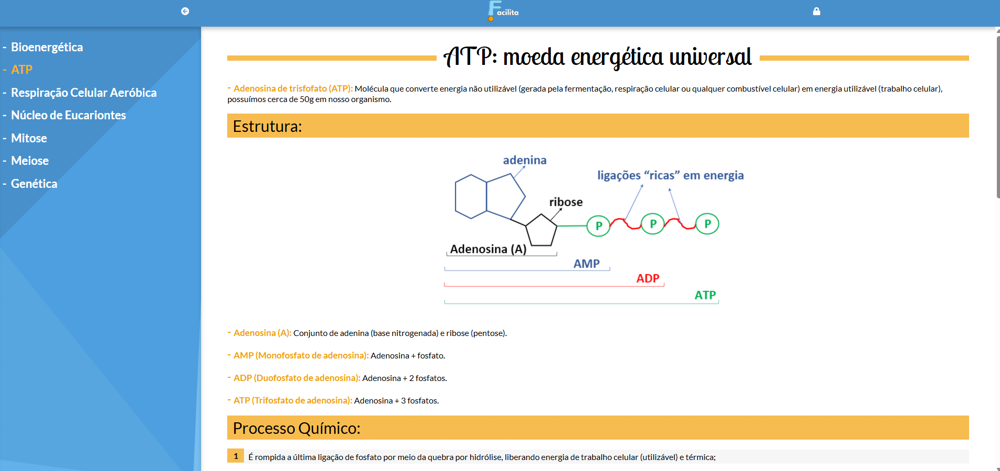
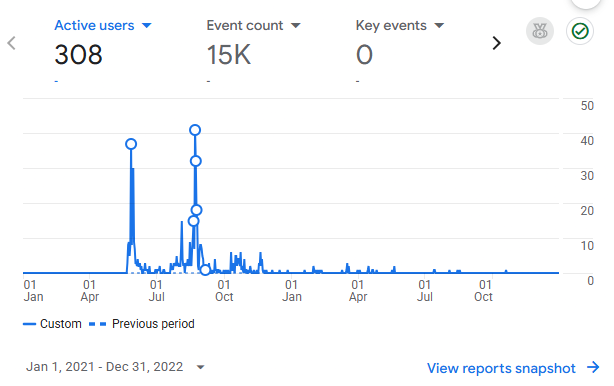
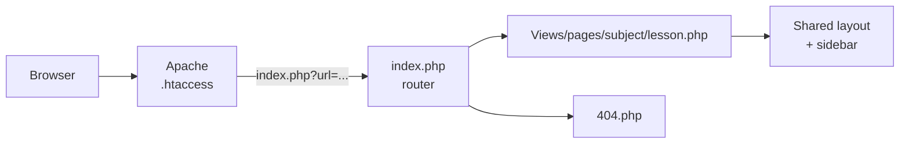

<div align="center">

# 📚 Facilita Estudos

**A free study platform for Brazilian high-school students, with a custom-built PHP content management system.**

[](https://facilitaestudos.freehosting.dev/)


> **👉 [Click here to view the live demo: facilitaestudos.freehosting.dev](https://facilitaestudos.freehosting.dev/)**


</div>

## ⚡ At a glance

| | |
|---|---|
| **What** | Summarized lessons for the 1st year of Brazilian high school (*1º ano do Ensino Médio*) |
| **My role** | Solo project: design, front end, back end, deployment |
| **Production** | Live at `facilitaestudos.com.br` behind Cloudflare, 2021–2022 (now offline) |
| **Users** | **300+** (Google Analytics; only home-page visits were tracked, so real reach was higher) |
| **Content** | 57 articles across 13 subjects |
| **Code** | ~4,400 lines of PHP/HTML, ~1,000 lines of CSS. No framework, no database |



## 📈 Usage

Active users while the site was live (Google Analytics, 2021–2022):



## ✨ Features

- **13 subjects** (Biology, Chemistry, Physics, Math, History, Literature and more), each with its own sidebar navigation
- **Clean URLs**, e.g. `/biologia/mitose`
- **Responsive layout** for phones
- **Admin CMS** behind a login, which generates new article pages from a form (title, subtitle, topic, list, image and custom blocks), so I didn't have to write the HTML by hand

## 🏗 How it works

Every request goes through a single entry point (the **front-controller** pattern):



1. `.htaccess` sends every request to `index.php`.
2. `index.php` loads the matching page from `Views/pages/`, or the 404 page.
3. Each page includes a shared layout. The sidebar comes from a small per-subject config array, so adding a subject needs no layout changes.

```text
Controllers/     login check, logout, sidebar rendering
Views/css/       stylesheets
Views/includes/  shared layout + one sidebar config per subject
Views/pages/     home, login, admin + one folder per subject
index.php        router
.htaccess        URL rewriting
```

## 🔒 Lessons learned

I built this as a student. Reviewing it today, these are the security issues I'd fix:

- **Hard-coded admin password** → store a `password_hash()` in an untracked config file
- **Login bypass:** any `lembrar` cookie is accepted as logged in → trust only the server session
- **Path traversal:** the router includes files based on the URL → allowlist valid page names
- **Code injection:** the admin writes raw input into `.php` files → store content as data and escape output

Next time I'd also keep the content in Markdown or a database instead of generated PHP files, and add a Dockerfile and automated tests.

## 👤 Author

**Pedro Cintra**